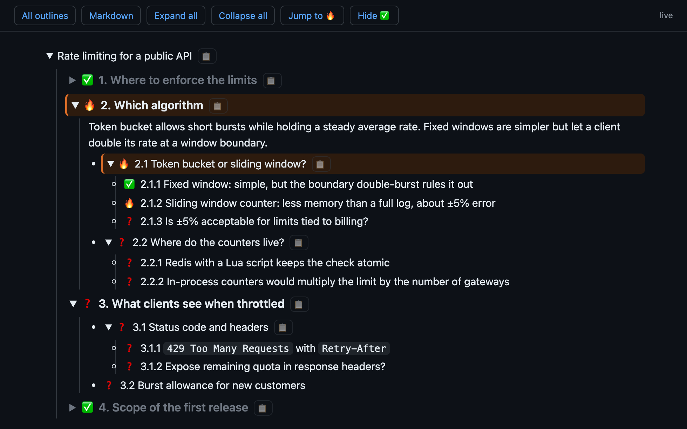

# Live Discussion Outline

When an AI agent answers with several numbered points and you drill into one, then go back to another, the chat scrolls away from you. This tool mirrors the conversation into a markdown outline that the agent keeps up to date, and serves it as a collapsible web page that updates in place on every change.

It is agent-agnostic. The server only watches a folder of markdown files; any agent that can write a file (Cursor, Codex, Gemini CLI, Aider, …) can feed it. A ready-made `/live-discussion-outline` skill is included for agents that support skills; for the others you give the agent the same instructions as a rule.

The solution has three parts:

1. **A skill you invoke.** `/live-discussion-outline` in a skills-capable agent. Other agents get the same instructions as a rules file.
2. **Instructions that make the agent write a markdown mirror of the discussion.** The agent keeps one file per conversation, with numbered points, status emoji and nested details, and edits it as the discussion moves.
3. **A small local server that renders that markdown as HTML.** It serves the outlines at `http://localhost:4577`, collapses and expands sections, and updates the page in place when the file changes.



The example in [`examples/demo/rate-limiting.md`](examples/demo/rate-limiting.md) is the markdown behind this screenshot.

Features:

- Every point and sub-point is numbered with its full path (`1`, `1.1`, `2.3.1`), in the chat and in the page, so "2.1" means the same thing in both places.
- Every point is a **node**: a numbered heading (`# 2. Topic`, `## 2.1 Title`, down to six levels) plus its text, which is ordinary markdown, plain bullets included. Status and other tags sit on the heading line after the number. The node under discussion carries an `@current` tag; the page draws an orange line on it and on every ancestor on its path. Approved topics start collapsed.
- The all-outlines table shows progress per outline: a stacked bar (green = `@approved`, blue = `@claim` / recommendations) plus counts.
- **Resume later:** an outline can carry a `Resume:` line (a link or command that reopens the chat it came from). The page has a **Copy chat link** button and the all-outlines table has a **Chat** column with a 📋 button, so you can find a paused discussion and reopen its chat. See `resumeTemplate` below.
- A **Markdown** button at the top switches to the plain rendered markdown (a normal preview, nothing collapsible) and back; the choice is remembered per outline.
- The discussion's title (the outline's `Title:` line) has a pencil beside it: click it, type a new name, press Enter to save or Escape to cancel.
- Nodes below a topic show as chat-style bubbles, one level of nesting inside another: number (last segment, full path on hover), title and text. Click anywhere on a parent row (outside its checkbox and buttons) to collapse or expand it; the circled number next to the side-chat button counts its direct children and fills in while the row is collapsed.
- Each node has a checkbox drawn from its status tag (none: open, `@claim`: the agent's claim, `@approved`: you approved it). A claim shows a blue outlined tick. A parent node shows the unique set of its descendants' icons (empty, blue agent tick, green pending human tick, filled human tick); if they all match, the parent shows that one icon. If any child is unchecked, the parent includes an empty checkbox. Ticking a parent also ticks every descendant. Ticking an open box, or clicking a blue agent tick, queues a human approval, draws a green outlined tick (pending, not filled), and copies the queued approval text to the clipboard. Queued approvals also show as tags in a bottom bar with a **Copy to clipboard** button, and are also included whenever you click a row's side-chat button (which copies that node's path). Copying clears the tags. The tick stays green-outlined until the agent writes `@approved` on that node; that file change is what fills the checkbox. A node tagged `@options` with child option nodes is a single choice: it shows a "◉ Pick one" tag, its options render as radio buttons (choosing one clears the others and copies `Chosen in the outline: …`), and the option tagged `@recommended` shows a blue outlined dot and a 💡 Recommended tag. `@options` on a leaf shows a red "❓ Options" tag. `@Recommendation.` in the node's text puts a 💡 Recommendation tag in the content cell, below the explanation and immediately before the recommendation, in that same cell, and shows the checkbox as a blue outlined tick.
- Page bar: the tabs, then expand all, collapse all, and jump to the current node. Which items you opened or closed is kept by the server, so it survives a reload and is the same in every window on the outline.
- **Terminal tab:** if the agent runs inside [tmux](https://github.com/tmux/tmux), the outline records the tmux session (`Terminal:` line) and the page gets a tab that shows that session's live terminal ([xterm.js](https://xtermjs.org)). Your own terminal and the page are two views of the same session: type in either. Start the agent with `tmux new -s <name> claude` (any agent works), then invoke the skill. The server sets `mouse on` for that tmux session so scrolling and clicks reach the agent.
- **Transcript tab:** with Claude Code, the outline also records the session id (`Session:` line) and the page gets a tab that renders the session's transcript as messages (your prompts, Claude's answers as markdown, tool calls collapsed with their input and output), updated live. It reads Claude Code's own log under `~/.claude/projects`, an internal format that may change. When the outline also has a `Terminal:` line, an input box at the bottom types your message into the tmux session as if you typed it there (Enter sends, Shift+Enter adds a line). Without tmux, for example in the desktop app, the tab is read-only.
- **Message box:** when the outline has a `Terminal:` line, a box at the bottom of the Outline, Markdown and Transcript tabs (one box, one draft) types your message into the session. On such a page, ticking or unticking a node, or picking an option, sends `Approved in the outline: …`, `Reopened in the outline: …` or `Chosen in the outline: …` by itself (clicks within about a second go as one message; undoing a change already sent sends the undo), and each row's button adds a chip for that item to the message box, sent as a `Re: outline …` line before your text. Without a session, these go to the clipboard as before.
- **Slash commands:** typing `/` at the start of the message box lists the commands the session can run, filtered as you type (arrows move, Tab or Enter completes, Esc closes): the skills the session itself lists (read from its transcript), user-only skills and commands from `~/.claude` and the project's `.claude` folder, and a short list of Claude Code built-ins, which may lag behind new versions. Commands that open a picker (`/resume`, `/config`, `/model` with no argument) show it in the Terminal tab.
- **Model and effort:** the dropdowns at the top right start from the outline's `Model:` line; changing one types `/model` or `/effort` into the session. Claude Code also saves that choice as your default for new sessions.
- **New session:** the outline list starts a session in tmux from a Cursor workspace, a folder, or a past Claude Code session (resumed), with the skill as its first message, and shows its terminal until the outline appears. Workspace files are looked for beside the folders your recent sessions ran in; set `workspaceDirs` to search elsewhere.
- **Resuming a session open elsewhere:** the Resume tab marks sessions still running in another app ("open in Cursor", "open in tmux session …"). Starting one that runs in Cursor, VS Code, the desktop app or another terminal offers to stop it there first, since two apps writing one session conflict; one already in tmux is opened instead. A session started fresh with nothing running under it can go unnoticed.
- **Done parents collapse:** when your click approves the last open descendant of a node, or picks an option, that node collapses over half a second and the page scrolls it to the top, just below the sticky headers above it. It does not wait for the agent. If the click completes several levels at once (up to the topic), the outermost one animates and the inner ones close with it; undo opens them again.
- **Undo:** the undo button in the page bar, or ⌘Z outside a text field, takes back your last approval click: a node's or topic's checkbox, or an option pick. Every node that click changed goes back to its own previous state, so approving a parent over mixed children and undoing it restores each child as it was. What was already sent is sent back as `Reopened in the outline: …`, `Chosen in the outline: …` (the option picked before), or `Back to claim in the outline: …` for nodes that were the agent's claims. Steps are kept per outline by the server, up to 50.
- **Queue:** the agent ends the outline with a `# @queue` section listing, by priority, the items it advises you to handle next (`- 2.1.3 @decide …`, `@approve`, `@read`). The page shows them as small buttons in the left pane, below the Discussions button; clicking one opens and highlights that item in the Outline tab. An item disappears as soon as you approve or pick it on the page, and the agent rewrites the queue after each answer.
- **Actions:** the agent tags nodes that propose something to do in the session (run tests, change code) `@action`; they get a red play button left of the checkbox. Pressing it sends `Run in the outline: …` (copied when no session is linked); the button waits, dimmed, until the agent has done it and marks the node `@ran`, which shows a "Ran" tag instead. Picking an action option puts it in the queue (`@action`, a red play icon) rather than running it.
- **Closing lines:** a long node's text ends with `@Summary.` (one sentence summing up that text; answers go into the text itself or into child nodes, never into the summary), then `@Recommendation.`, then, on an action, `@Action.` (what running it will do). Each shows on its own line after a Summary, 💡 Recommendation or ▶ Action tag.
- **Working spinner:** left of the message box, it spins while the agent is in a turn: on as soon as the page sends something, off when the session's transcript records the end of the turn (needs the `Session:` line).
- **Messages:** for things it does not put in the outline (the outcome of a build or test you asked for in chat, a status), the agent starts a paragraph of its chat reply with `@message`, optionally followed by a node number. The page reads these from the transcript: a red envelope at the bottom of the left pane lists the last ten, with an unseen count, and a node with messages (its own or its descendants') gets its own grey envelope listing just those. Nothing goes into the markdown.
- **Unread changes:** when the agent rewrites a node you have already seen (say, merging an answer into it), the page keeps showing what you read, with a blue diff icon left of its checkbox, so the outline doesn't jump. Clicking the diff icon, or the node's diff item at the top of the left pane, animates the bubble to the new text with a cursor that passes through it from the start: it scans over unchanged words, added words grow in one by one in green (pushing the rest of the text along), removed words in red collapse one by one, and rewritten words collapse while their replacements grow in beside them, in white; each fades out after a second. Long texts go faster, and nothing animates if the page is hidden or the system asks for reduced motion. What you have seen is kept per outline by the server; nodes that are new still appear right away.
- **Project:** the top bar shows the discussion's project (workspace or repo); its tooltip names the folder Claude runs in.
- **Delete:** the trash button on a row of the outline list (or swiping the row left) asks once, then moves the outline to `.trash/<project>/` in the outlines folder. The session and its transcript are untouched.
- The top bar stays one row: what doesn't fit moves into a `⋯` menu.
- The terminal socket, the transcript stream, and the input box accept only this machine's own page (loopback address, `localhost`/`127.0.0.1` host, and for typing, our own origin).
- Every row has a 📋 button; click it to copy a reference (`Re: outline "…" › 2.1 …`) to paste into the chat and continue about that item.
- The agent only writes markdown (cheap to edit, easy to diff). The server renders it.

## Setup

Requires Node 20.19+ (or 22.12+). The Terminal tab, and typing from the Transcript tab, also need tmux (`brew install tmux`). `npm install` also builds the new page (a React app in `web/`, see below) into `web/dist` with Vite; node-pty ships prebuilt binaries for macOS and Windows (other platforms compile it, and if that fails the Terminal tab is just not offered).

```bash
git clone https://github.com/hepiyellow/live-discussion-outline
cd live-discussion-outline
npm install
```

### Agents with skills support

```bash
npm run install-skill                # links the /live-discussion-outline skill into the default skills folder
npm run install-skill -- <folder>    # or into a skills folder of your choice
```

Then, in any conversation, type `/live-discussion-outline` (optionally `/live-discussion-outline some topic`). The agent starts the server if it is not running, writes the outline, and replies with a link. The skill is user-invoked only (`disable-model-invocation: true`); remove that line from `skill/SKILL.md` and re-run `npm run install-skill` if you want the agent to start outlines itself.

### Any other agent

1. Put the instructions in [`skill/SKILL.md`](skill/SKILL.md) (everything below the frontmatter) into your agent's rules file: `AGENTS.md`, `.cursor/rules`, `GEMINI.md`, `CONVENTIONS.md`, and so on. The skill tells the agent to resolve this checkout from the skill file's path.
2. Start the server yourself with `npm start` (or `node bin/ensure.js`, which starts it in the background and prints the outlines folder and URL).
3. Tell the agent to start an outline. It writes `<outlines folder>/<project>/<date>-<topic>.md` in the documented format and keeps editing the same file.

The format is plain markdown: a `Title:` line, then numbered headings as nodes with `@` tags for status, and ordinary markdown as each node's text; see the skill for the exact rules.

### Viewing

Open the URL in a browser, or in an editor tab (in Cursor/VS Code: command palette → **Simple Browser: Show**, paste the URL).

### How the page works

The page is a React single-page app fed by JSON over server-sent events ([ADR 0001](docs/adr/0001-react-spa-fed-by-json-over-sse.md), [plan](docs/plans/viewer-spa.md)), built from `web/` into `web/dist` by `npm install`. It shows the outline list at `/`, an outline at `/<project>/<file>`, and a session just started at `/live?t=<tmux session>`; links to the old `/app/…` paths redirect there.

It reads `/api/outline/<project>/<file>`: the outline as JSON (header lines, nodes, queue and the Markdown tab; `web/src/types.ts` describes it), parsed by `outline.js`. `/api/outline/<project>/<file>/events` streams it, sent again whenever that file changes, so an agent's edit re-renders only what changed.

What the page remembers for you (open and closed nodes, unsent approvals, what you have read, undo steps, seen messages, the input box's draft and the tab shown) is kept by the server, one file per outline in `.state/` of the outlines folder (`/api/state/<project>/<file>`), so the Outline app and a browser show the same thing. Marks the old page kept in the browser (what you had read, unsent ticks) were not carried over.

```bash
npm run build    # rebuilds web/dist after a change to web/ (npm install does this too)
npm run dev      # or `npm start -- --dev`: serves web/src through Vite instead, reloading edits in place
npm test         # type-checks web/ and runs the tests in test/
```

The browser tests run headless Chromium through Playwright: install it once with `npx playwright install chromium`, or point `PLAYWRIGHT_CHROMIUM` at a Chromium binary you already have.

## Configuration

Settings come from environment variables, then the config file, then defaults.

| Setting | Env var | Config file key | Default |
| ------- | ------- | --------------- | ------- |
| Folder for the markdown outlines | `OUTLINE_DIR` | `dir` | `~/live-discussion-outlines` |
| Server port | `OUTLINE_PORT` | `port` | `4577` |
| Bind address | `OUTLINE_HOST` | `host` | `127.0.0.1` |
| Template for the resume link or command the agent writes into each outline; `{session}` is replaced by the chat's session id | `OUTLINE_RESUME_TEMPLATE` | `resumeTemplate` | none |

The config file is `~/.config/live-discussion-outline/config.json` (override the path with `OUTLINE_CONFIG`):

```json
{ "dir": "~/Documents/outlines", "port": 4577, "resumeTemplate": "myagent --resume {session}" }
```

Outlines are stored as `<dir>/<project>/<date>-<topic>.md`, one folder per project, outside your repos. The page for a file is `http://localhost:<port>/<project>/<date>-<topic>`; `/` lists them all.

### Resuming a chat

How to reopen a chat depends on the agent, so the template is yours to configure. The `/live-discussion-outline` skill reads it from `bin/ensure.js` (`resume=` line), fills in the chat's session id, and writes the finished link or command as the outline's `Resume:` line. The page copies that line as written; the server never interprets it.

Examples (check your tool's docs for the exact form; these are the ones I know):

| Agent | `resumeTemplate` |
| ----- | ---------------- |
| Claude Code (terminal) | `claude --resume {session}` |
| Claude Code (editor extension) | `vscode://anthropic.claude-code/open?session={session}` (use `cursor://` in Cursor) |
| Codex CLI | `codex resume {session}` |

Web-only chat products (ChatGPT, Grok, …) cannot write files, so they cannot run the skill; to track such a chat, paste its URL as the outline's `Resume:` line yourself.

If the template is empty, the agent writes a `Resume:` line only when it knows its own way to reopen a chat, and otherwise leaves it out.

To apply new settings, stop the server (`pkill -f live-discussion-outline/server.js`) and start it again with `npm start` (or the next `/live-discussion-outline` starts it).

## Notes

- Binds to localhost only. Raw HTML in the markdown is escaped. The server log is `live-discussion-outline.log` in your temp folder.
- Topics and nodes with children become collapsible. The markdown stays readable in any viewer.
- The 📋 button only copies to the clipboard. Injecting text into an existing chat through an editor URI handler did not work when tried; the Terminal and Transcript tabs are the way to type into a discussion from the page.

## License

MIT
